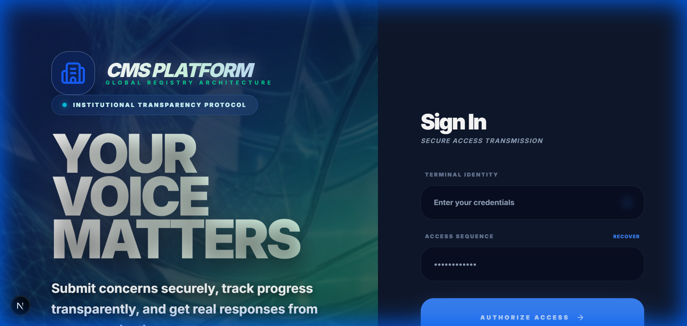
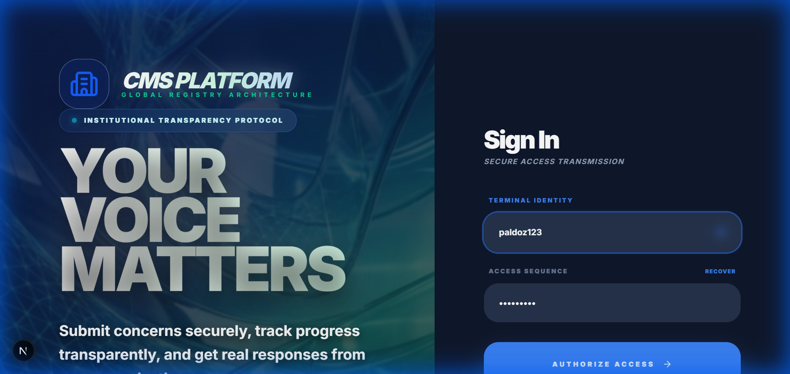
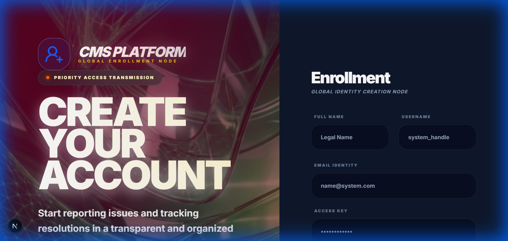

# CMS Global - Registry System 💎

CMS Global is a premium, high-performance **Compliment & Complaint Management System** designed for modern organizations. It features a stunning 'spectral' dark-mode UI, secure authentication, and an advanced automated notification engine.

## 🚀 System Overview

The system provides a seamless bridge between users and organizations, ensuring transparency, accountability, and fast resolution.

### Key Features
- **Premium 'Image UI' Design**: Immersive dark mode with spectral radial glows and glassmorphism.
- **Smart Audit Engine**: Comprehensive tracking of all organizational activity.
- **Automated Notification Engine**: Professional 'short & best' email notifications for status updates and alerts.
- **Role-Based Access**: Specialized dashboards for Users, Admins, and Super Admins.
- **Secure Verification**: Identity-first signup flow with OTP verification.

## 🍱 Visual Showcase

| Login Experience | Secure Registration |
| :---: | :---: |
|  |  |

## 🛠️ Tech Stack
- **Framework**: Next.js 15 (App Router)
- **Database**: PostgreSQL with Prisma ORM
- **Authentication**: NextAuth.js
- **Styling**: Vanilla CSS & TailwindCSS
- **Mail Engine**: Nodemailer with Custom Premium Templates

## 🔒 Security
Your privacy is our priority. Credentials and sensitive logic are strictly protected by environment masking and secure session management.

---
Built with passion by **abdiqani dahir abdullahi [paldoz]**
